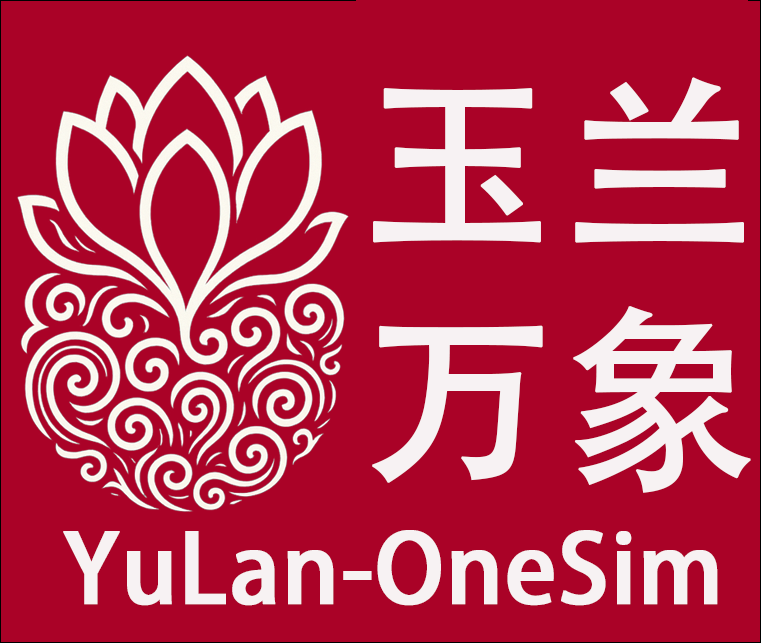
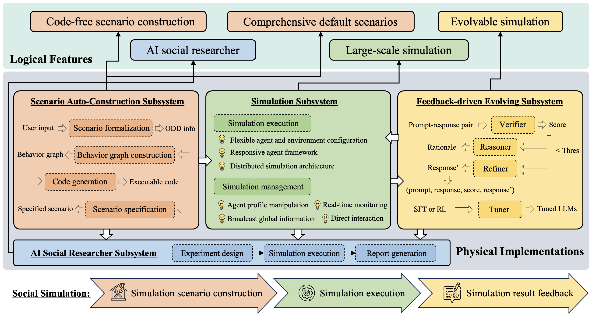

# 🌸 YuLan-OneSim (玉兰-万象)

<p align="center">
  
</p>

<div align="center">

[](https://arxiv.org/abs/2505.07581)
[](LICENSE)
[](https://www.python.org/downloads/)
[](CONTRIBUTING.md)
[](https://github.com/RUC-GSAI/YuLan-OneSim/stargazers)


**YuLan-OneSim:Next Generation Social Simulator with Large Language Models**

</div>

## 📰 News
- **[May 2025]** 🎉 Initial release of YuLan-OneSim! Our paper is now available on [arXiv](https://arxiv.org/abs/2505.07581).

## 📋 Overview

YuLan-OneSim (玉兰-万象) is a groundbreaking social simulator that leverages Large Language Model (LLM) agents to model human social behaviors. Our framework bridges the gap between social science and artificial intelligence by offering a powerful, intuitive platform for research and exploration.

## ✨ Key Features

- 🔄 **Code-free scenario construction**: Design complex simulations through natural language conversations
  
- 📚 **Comprehensive default scenarios**: 50+ default scenarios across 8 major social science domains

- 🧠 **Evolvable simulation**: Models that automatically improve based on external feedback

- 🚀 **Large-scale simulation**: Distributed architecture supporting up to 100,000 agents

- 🔍 **AI social researcher**: Autonomous research from topic proposal to report generation

<p align="center">
  
</p>

## 🛠️ Installation

```bash
# Clone the repository
git clone https://github.com/yourusername/YuLan-OneSim.git
cd YuLan-OneSim

pip install -e .  # Install in editable mode
```

## 🚀 Quick Start

### Command-Line Interface

```bash
# Run a simulation with default settings
yulan-onesim-cli --config config/config.json --model_config config/model_config.json --mode single --env labor_market_matching_process
```

### Web Server

```bash
# Start the backend API service (from the project root directory)
yulan-onesim-server

# In a new terminal, navigate to the frontend directory and start the frontend application
cd src/frontend
npm install # If you haven't installed dependencies
npm run dev # Or your specific command to start the frontend
```

Access the web interface (frontend) at `http://localhost:5173` and the API documentation (backend) at `http://localhost:8000/docs` .


<p align="center">
  
</p>

## ⚙️ Configuration

YuLan-OneSim uses JSON configuration files to control simulation behavior and model settings.

<details>
<summary>Click to expand configuration details</summary>

### Simulation Configuration (`config/config.json`)

Controls general simulation settings including environment, agents, database, and distribution parameters.

### Model Configuration (`config/model_config.json`)

Specifies the LLMs and embedding models used by the simulator, including provider details and generation parameters.

</details>

## 📁 Project Structure

```
├── config/        # Configuration files
├── src/           # Main source code
│   ├── onesim/    # Core simulation framework
│   ├── backend/   # FastAPI backend
│   ├── frontend/  # UI components
│   ├── llm_tuning/# Model fine-tuning
│   ├── envs/      # Simulation environments
│   └── researcher/# AI Social Researcher
├── scripts/       # Utility scripts
└── tests/         # Test code
```

## 📊 Examples

<details>
<summary>Labor Market Simulation</summary>

```bash
yulan-onesim-cli --config config/config.json --model_config config/model_config.json --mode single --env labor_market_matching_process
```

This simulation models job matching dynamics between employers and job seekers, analyzing equilibrium wage patterns and matching efficiency.
</details>


## 👥 Contributing

Contributions are welcome! Please feel free to submit a Pull Request.

## 📄 Citation

If you use YuLan-OneSim in your research, please cite our paper:

```bibtex
@misc{wang2025yulanonesimgenerationsocialsimulator,
      title={YuLan-OneSim: Towards the Next Generation of Social Simulator with Large Language Models}, 
      author={Lei Wang and Heyang Gao and Xiaohe Bo and Xu Chen and Ji-Rong Wen},
      year={2025},
      eprint={2505.07581},
      archivePrefix={arXiv},
      primaryClass={cs.AI},
      url={https://arxiv.org/abs/2505.07581}, 
}
```

## 📝 License

This project is licensed under the [Apache-2.0 License](LICENSE.txt).
