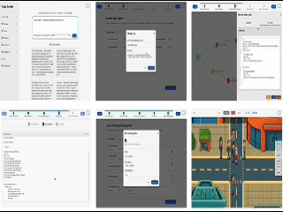
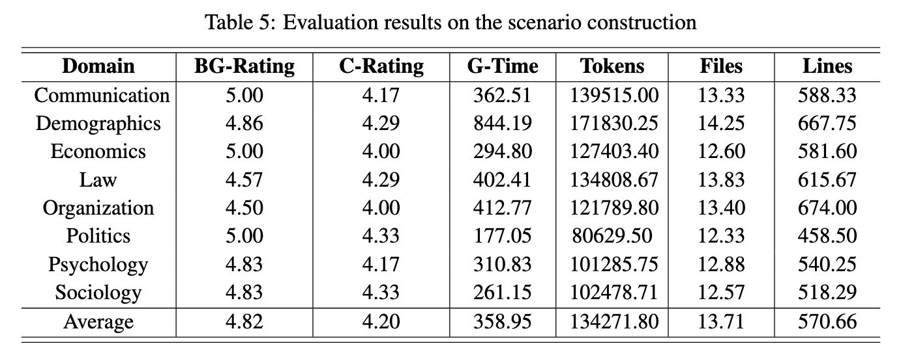
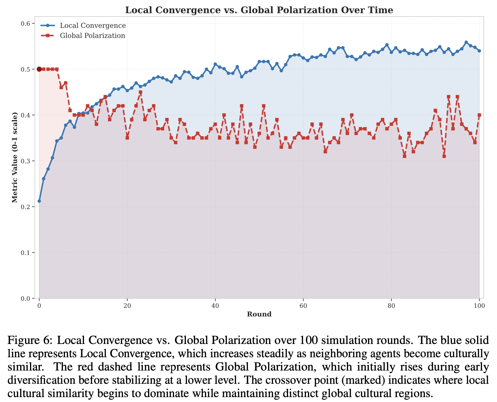
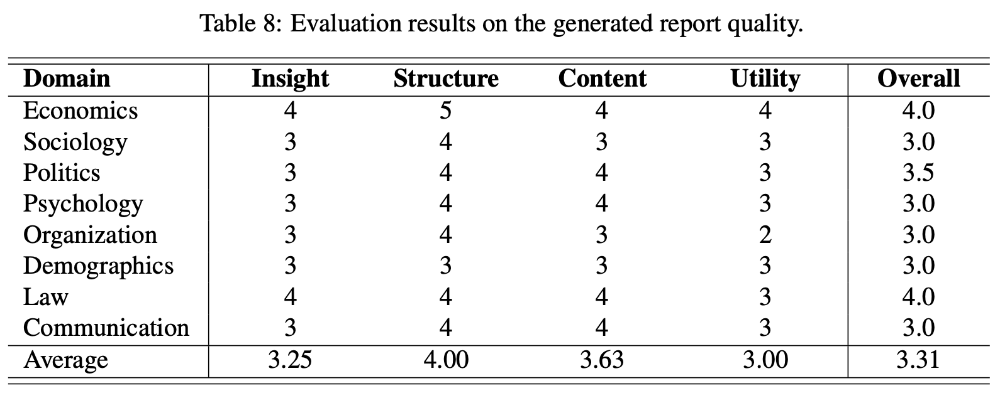

#  YuLan-OneSim (玉兰-万象)


<p align="center">
  
</p>

<div align="center">

[](https://arxiv.org/abs/2505.07581)
[](LICENSE)
[](https://www.python.org/downloads/)
[](CONTRIBUTING.md)
[](https://github.com/RUC-GSAI/YuLan-OneSim/stargazers)


## YuLan-OneSim:Next Generation Social Simulator with Large Language Models

</div>

## 📰 News
- **[2025-5-13]** 🎉 Initial release of YuLan-OneSim! Our paper is now available on [arXiv](https://arxiv.org/abs/2505.07581).

## 📋 Overview

YuLan-OneSim (玉兰-万象) is a groundbreaking social simulator that leverages Large Language Model (LLM) agents to model human social behaviors. Our framework bridges the gap between social science and artificial intelligence by offering a powerful, intuitive platform for research and exploration.

## ✨ Key Features

- 🔄 **Code-free scenario construction**: Design complex simulations through natural language conversations
  
- 📚 **Comprehensive default scenarios**: 50+ default scenarios across 8 major social science domains

- 🧠 **Evolvable simulation**: Models that automatically improve based on external feedback

- 🚀 **Large-scale simulation**: Distributed architecture supporting up to 100,000 agents

- 🔍 **AI social researcher**: Autonomous research from topic proposal to report generation


<p align="center">
  
</p>

## 🛠️ Installation

```bash
# Clone the repository
git clone https://github.com/RUC-GSAI/YuLan-OneSim
cd YuLan-OneSim

pip install -e .  # Install in editable mode
pip install -e .[tune]  # Install with tuning dependencies if needed
```

## 🚀 Quick Start

### Command-Line Interface

```bash
# Run a simulation with default settings
yulan-onesim-cli --config config/config.json --model_config config/model_config.json --mode single --env labor_market_matching_process
```

### Web Server

```bash
# Start the backend API service (from the project root directory)
yulan-onesim-server

# In a new terminal, navigate to the frontend directory and start the frontend application
cd src/frontend
npm install # If you haven't installed dependencies
npm run dev # Or your specific command to start the frontend
```

Access the web interface (frontend) at `http://localhost:5173` and the API documentation (backend) at `http://localhost:8000/docs` .


<p align="center">
  
</p>

## ⚙️ Configuration

YuLan-OneSim uses JSON configuration files to control simulation behavior and model settings.

<details>
<summary>Click to expand configuration details</summary>

### Simulation Configuration (`config/config.json`)

Controls general simulation settings including environment, agents, database, and distribution parameters.

### Model Configuration (`config/model_config.json`)

Specifies the LLMs and embedding models used by the simulator, including provider details and generation parameters.

</details>

## 📁 Project Structure

```
├── config/        # Configuration files
├── src/           # Main source code
│   ├── onesim/    # Core simulation framework
│   ├── backend/   # FastAPI backend
│   ├── frontend/  # UI components
│   ├── llm_tuning/# Model fine-tuning
│   ├── envs/      # Simulation environments
│   └── researcher/# AI Social Researcher
├── scripts/       # Utility scripts
└── tests/         # Test code
```

## 📊 Examples

<details>
<summary>Labor Market Simulation</summary>

```bash
yulan-onesim-cli --config config/config.json --model_config config/model_config.json --mode single --env labor_market_matching_process
```

This simulation models job matching dynamics between employers and job seekers, analyzing equilibrium wage patterns and matching efficiency.
</details>


## 🧪 Experiments

1️⃣ Evaluation of the Automatic Scenario Generation Framework:

<p align="center">
  
</p>

We conducted a comprehensive evaluation of YuLan-OneSim’s capabilities in automatic scenario generation. In terms of efficiency, the simulator achieves an average generation speed of 358 tokens per second. In terms of effectiveness, the quality scores for the generated agent behavior graphs and code both exceed 4 points (based on the scoring criteria described in the paper), demonstrating the system’s strong potential in automatic scenario construction.

<p align="center">
  
</p>

Meanwhile, we observed that most of the errors generated by YuLan-OneSim are logical in nature. These include issues such as value access errors, mismatches between instructions and actions, incorrect value assignments, and omissions in type checking. Such errors can typically be resolved using standard debugging techniques and require minimal human intervention. However, their prevalence suggests that targeted improvements in logical verification could significantly enhance the reliability of the overall code generation process. Additionally, although syntax errors and robustness issues are also present in the generated outputs, they account for only a small portion of the total errors. While the current results are promising, our implementation still faces certain limitations when dealing with more complex logical dependencies and edge cases. To address these challenges, we plan to incorporate more advanced error detection and correction mechanisms in future work, aiming to further reduce the need for manual code adjustments.

2️⃣ Simulation Effectiveness Evaluation

To evaluate credibility, we conduct experiments from two perspectives: (1) Social Theory Validation — examining whether established classic social science theories can be validated within our simulation environment; (2) Real-World Data Alignment — assessing the degree of consistency between simulation results and real-world observational data.

<p align="center">
  
</p>

In Experiment (1), we conduct simulations based on the Axelrod cultural dissemination model. As the simulation progresses, distinct cultural boundaries gradually emerge. Within each cultural region, neighboring agents exhibit high similarity (indicated by darker connection colors), while the boundaries between regions become increasingly clear. This visualization effectively reflects the core insight of Axelrod’s theory: local interactions foster cultural homogeneity within regions, while cultural diversity is preserved on a global scale.


<p align="center">
  
</p>

We also conducted a dynamic and quantitative analysis of the formation process underlying Axelrod’s theory. As shown in the figure above, during the initial phase, the local convergence within communities gradually increases, while global polarization continues to decline—indicating that agents begin interacting and forming early-stage cultural clusters. Around the 15th iteration, an inflection point emerges: local convergence continues to rise, while global polarization stabilizes. This trend suggests that regions are becoming increasingly homogeneous internally, while the boundaries between different cultural groups remain clearly distinguishable.

These experimental results clearly illustrate the core of Axelrod’s theory—the coexistence of local convergence and global polarization. YuLan-OneSim not only successfully reproduces this theoretical expectation but also provides a quantitative characterization of the process, offering deeper insights into the temporal dynamics of cultural dissemination.

<p align="center">
  
</p>

In Experiment (2), we examine whether the data generated by the simulator aligns with real-world observations. Specifically, we conduct an experiment using housing market data from Brazil. Figure 8 presents a comparison between the simulated housing price distribution and the actual distribution in Brazil. The simulation successfully reproduces several key features observed in the real data—most notably, the multimodal distribution pattern with primary and secondary peaks that closely match the normalized values of the real distribution.

In the low-price range (0.05–0.25), the strong agreement between simulated and real data suggests that our model effectively captures the core dynamics of the most common housing market segment. Additionally, the simulation reflects the characteristic long-tail distribution often seen in housing markets. However, in the mid-range price interval (0.45–0.55), the simulation slightly underestimates the actual data. We attribute this discrepancy primarily to simplified modeling of the housing price formation process, which does not fully account for complex factors such as neighborhood livability, infrastructure quality, and historical valuations.

Despite this deviation, the overall results demonstrate that YuLan-OneSim can approximate real-world economic distribution patterns with high accuracy, validating its potential and practicality for applications in social science research.


3️⃣ Evaluation of the AI Social Researcher

<p align="center">
  
</p>

<p align="center">
  
</p>

In the evaluation of the AI Social Researcher, we focus primarily on the quality of the generated simulation scenario (ODD protocol) and the final analytical report. The results show that the AI Social Researcher performs well across all evaluation criteria for scenario design, achieving an average overall score of 4.13 out of 5. Notably, it excels in the "Feasibility" dimension, with an average score of 4.88, indicating its strong ability to translate abstract research questions into executable simulation plans. It also performs well in "Relevance" (average score of 4.25), ensuring that the generated scenarios are closely aligned with the user-defined research topics.

In terms of report generation, the AI Social Researcher demonstrates solid performance in "Structural Organization" (average score of 4.00) and "Content Completeness and Accuracy" (average score of 3.63), showing that it can effectively structure analysis results into logically coherent and well-supported technical reports. The top-performing reports include “Auction Market Dynamics” (Economics) and “Court Trial Simulation” (Law), each receiving an overall score of 4.0.

However, there remains room for improvement, particularly in the dimensions of "Insightfulness" (3.25) and "Practicality" (3.00). While the AI Social Researcher is competent in data analysis and reporting, it still struggles to extract deeper research insights and formulate actionable recommendations from simulation results. For instance, in the scenario “Labor Market Matching Process,” the report received a low practicality score of 2.0, highlighting the current limitations of the model in certain domain-specific applications.


## 👥 Contributing

Contributions are welcome! Please feel free to submit a Pull Request.

## 📄 Citation

If you use YuLan-OneSim in your research, please cite our paper:

```bibtex
@misc{wang2025yulanonesimgenerationsocialsimulator,
      title={YuLan-OneSim: Towards the Next Generation of Social Simulator with Large Language Models}, 
      author={Lei Wang and Heyang Gao and Xiaohe Bo and Xu Chen and Ji-Rong Wen},
      year={2025},
      eprint={2505.07581},
      archivePrefix={arXiv},
      primaryClass={cs.AI},
      url={https://arxiv.org/abs/2505.07581}, 
}
```

## 📝 License

This project is licensed under the [Apache-2.0 License](LICENSE.txt).
